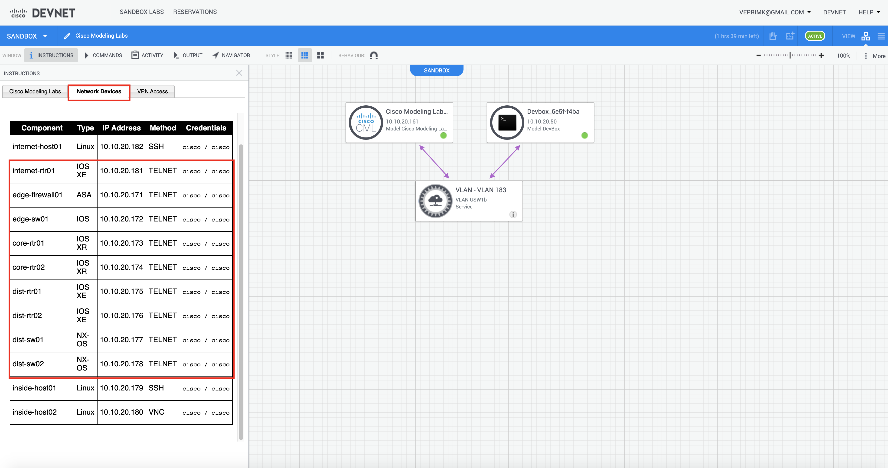

DevNet Cisco Modelling Labs Environment
=======================================

Head to [Cisco DevNet CML Sandbox](https://devnetsandbox.cisco.com/RM/Diagram/Index/45100600-b413-4471-b28e-b014eb824555?diagramType=Topology) and reserve the sandbox.

Once you have received confirmation that the environment setup has been completed. Connect on VPN so that the devices are reachable. 
Click on the Network Devices tab under Instructions  the device information and copy the info in the inventory.csv file and save it on the same directory as csv2nornir_inventory.py script file.


```
name,hostname,platform,port,username,password,groups
internet-rtr01,10.10.20.181,xe,23,cisco,cisco,cisco
edge-firewall01,10.10.20.171,asa,23,cisco,cisco,cisco
edge-sw01,10.10.20.172,ios,23,cisco,cisco,cisco
core-rtr01,10.10.20.173,xr,23,cisco,cisco,cisco
core-rtr02,10.10.20.174,xr,23,cisco,cisco,cisco
dist-rtr01,10.10.20.175,xe,23,cisco,cisco,cisco
dist-rtr02,10.10.20.176,xe,23,cisco,cisco,cisco
dist-sw01,10.10.20.177,nxos,23,cisco,cisco,cisco
dist-sw02,10.10.20.178,nxos,23,cisco,cisco,cisco
```
Make sure you create your groups.yaml with cisco object as per below:

```
---
cisco:
  connection_options:
    netmiko:
       extras:
         device_type: 'cisco_ios_telnet'
```
Then you can either execute the script to generate the Yaml inventory file by executing:
```
python csv2nornir_inventory.py
```
Or add it to your programming logic and create the Yaml inventory file on your Nornir script like the example below:

```
from nornir import InitNornir
from csv2nornir_inventory import Csv2NornirSimple


csv2n = Csv2NornirSimple("inventory.csv")
inventory_list = csv2n.inventory_converter()
csv2n.make_nornir_inventory()

# Verify that the inventory file is readable

nr = InitNornir(inventory={"plugin": "nornir.plugins.inventory.simple.SimpleInventory", "options": {"host_file": "csv_inventory.yaml"}})
for host in nr.inventory.hosts:
    print(f"""
    hostname: {nr.inventory.hosts[host].hostname}
    platform: {nr.inventory.hosts[host].platform}
    port:     {nr.inventory.hosts[host].port}
    username: {nr.inventory.hosts[host].username}
    password: {nr.inventory.hosts[host].password}
    groups:   {nr.inventory.hosts[host].groups}
    """)
```

Let's verify the contents on the folder:
```
❯ ls -l
-rw-r--r--@ 1 user  staff  2777  8 Sep 14:32 csv2nornir_inventory.py
-rw-r--r--@ 1 user  staff   733 10 Sep 20:40 csv_nornir.py
-rw-r--r--  1 user  staff   101 10 Sep 20:32 groups.yaml
-rw-r--r--@ 1 user  staff   497 10 Sep 20:33 inventory.csv

csv2nornir_inventory/example on  master [✘!?] via 🐍 v3.8.5 (venv)
❯
```

Now let's execute our example script to verify that Nornir is reading inventory file:
```
❯ python csv_nornir.py
Inventory file created...

    hostname: 10.10.20.181
    platform: ixe
    port:     23
    username: cisco
    password: cisco
    groups:   ['cisco']


    hostname: 10.10.20.171
    platform: asa
    port:     23
    username: cisco
    password: cisco
    groups:   ['cisco']


    hostname: 10.10.20.172
    platform: ios
    port:     23
    username: cisco
    password: cisco
    groups:   ['cisco']


    hostname: 10.10.20.173
    platform: xr
    port:     23
    username: cisco
    password: cisco
    groups:   ['cisco']


    hostname: 10.10.20.174
    platform: xr
    port:     23
    username: cisco
    password: cisco
    groups:   ['cisco']


    hostname: 10.10.20.175
    platform: xe
    port:     23
    username: cisco
    password: cisco
    groups:   ['cisco']


    hostname: 10.10.20.176
    platform: xe
    port:     23
    username: cisco
    password: cisco
    groups:   ['cisco']


    hostname: 10.10.20.177
    platform: nxos
    port:     23
    username: cisco
    password: cisco
    groups:   ['cisco']


    hostname: 10.10.20.178
    platform: nxos
    port:     23
    username: cisco
    password: cisco
    groups:   ['cisco']
```

As can be seen inventory file has been accepted by Nornir object and now you can use it to setup your automation!

